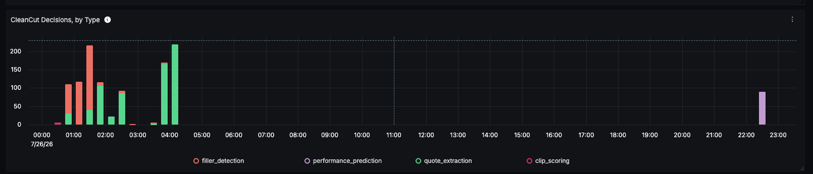
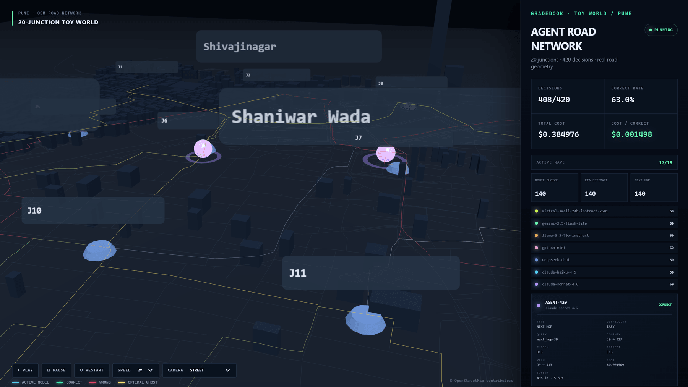
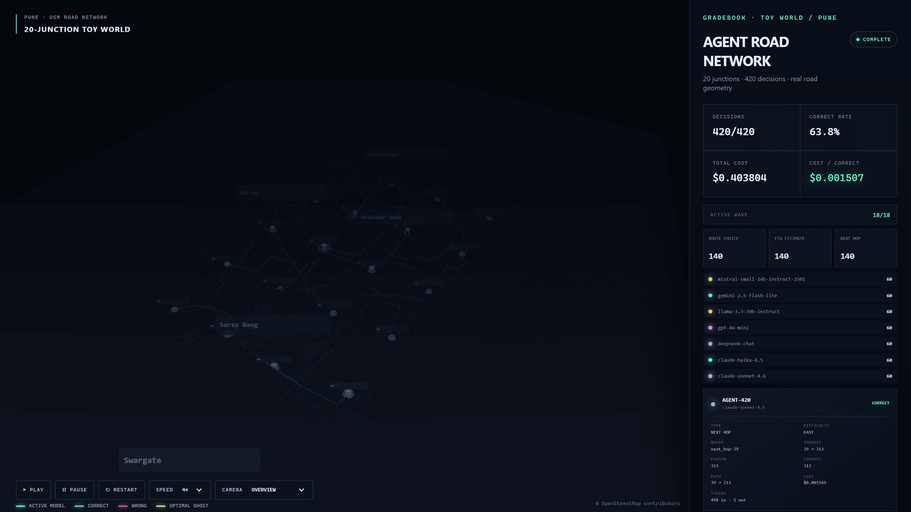
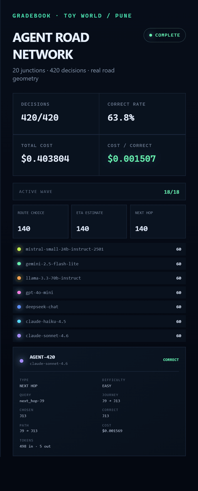
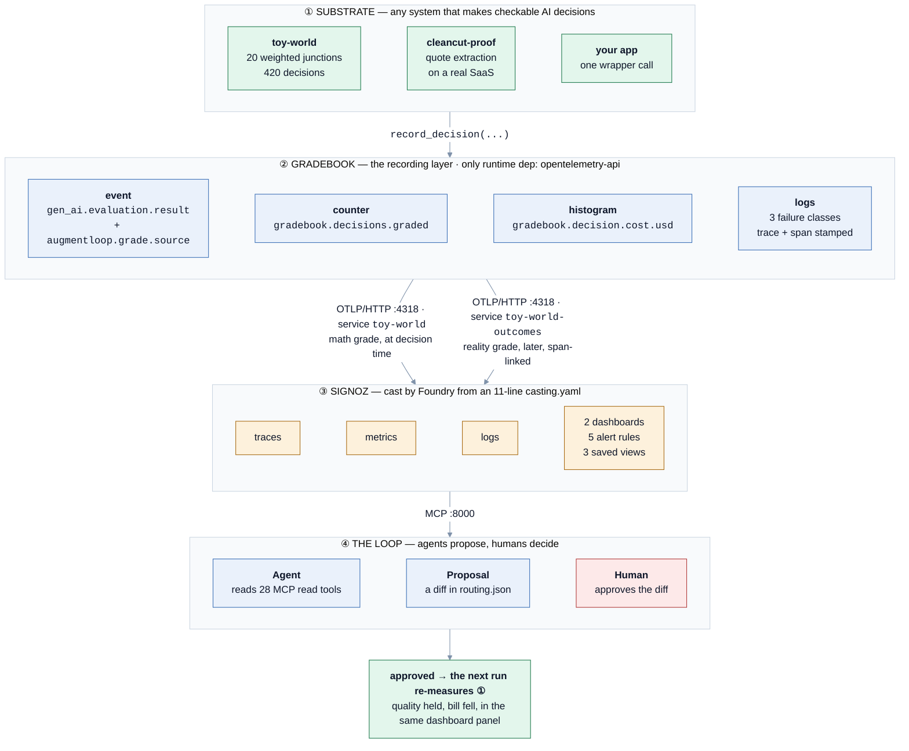
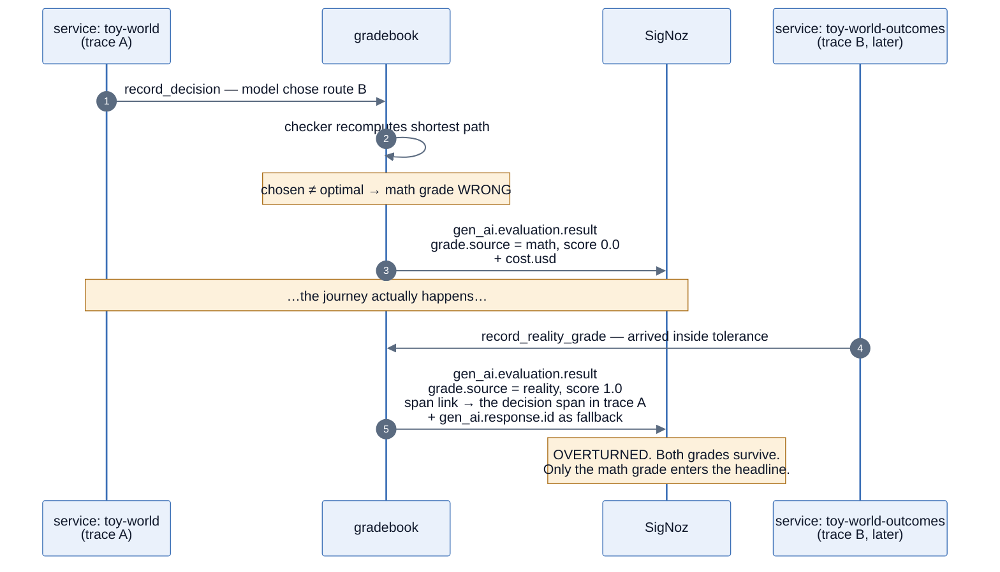
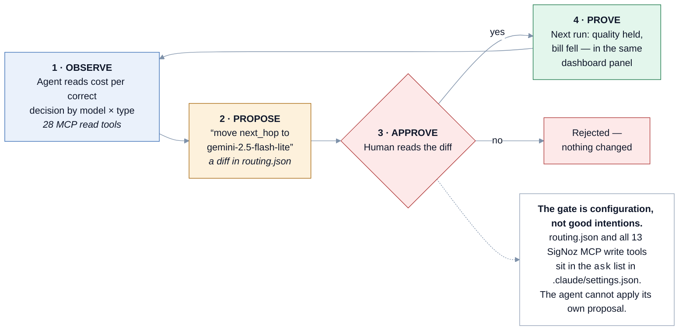

<div align="center">

# Gradebook

### Cost per correct decision — the metric that turns *"our AI is doing well"* into a measurement

[](https://github.com/mukundheda/augmentloop-signoz-hackathon/actions/workflows/ci.yml)
[](https://gradebook-toy-world.vercel.app)
[](LICENSE)
[](https://wemakedevs.org/hackathons/signoz)

**Team AugmentLoop** · Agents of SigNoz (WeMakeDevs × SigNoz), Track 01: AI & Agent Observability

[Live demo](https://gradebook-toy-world.vercel.app) ·
[Judge walkthrough](docs/judge-run.md) ·
[Recording contract](docs/conventions.md) ·
[Right-sizing loop](docs/right-sizing-loop.md) ·
[ADRs](docs/adr/)

</div>

---

## The one-paragraph version

Every AI decision your system makes is recorded as a standard OpenTelemetry `gen_ai.evaluation.result` event, stamped with **where its grade's authority came from** — a deterministic checker (`math`), a real-world outcome (`reality`), or another model's opinion (`ai_judge`). Only the first two ever enter the headline number, **cost per correct decision**, which is what the SigNoz dashboards show. An agent reads that number through the SigNoz MCP server and can *propose* routing a decision type to a cheaper model; a human approves the diff. Nothing applies itself. **Agents propose, humans decide.**

The whole thing is proven on **toy-world** — a 20-junction road network where every answer key is computed, so all 420 decisions in the committed run are machine-gradeable, and a judge can reproduce every number on a cold laptop with no API key.

---

## What this looks like in SigNoz

Everything below is a live capture of this project running, not a mockup. Two
substrates report into the same dashboard: `toy-world`, where we compute the
answer key ourselves, and `cleancut-proof`, a real revenue-generating product
where we do not.

Each screenshot below is a clickable link to the exact live SigNoz panel it
shows (`http://localhost:8080/...`). Those links only resolve on a machine
running this stack. If you've followed [the judge run](docs/judge-run.md), your
own cast will provision its own dashboard under a different UUID than the one
hardcoded here, so our specific links will 404 for you — but the widget IDs
are pinned in `dashboards/gradebook-cost-per-correct-decision.json` and stay
the same, so open your own "Gradebook: Cost per Correct Decision" dashboard and
the equivalent panel is one click away. The screenshots are the durable
evidence either way; the links are a bonus for anyone driving the same
instance we captured these from.

[](http://localhost:8080/dashboard/019f8d8a-eeaf-7bc0-a981-43196af8a781)

*The headline dashboard. The `$grade_source` selector at the top is the whole
argument in one control: set it to `math` and the number counts only grades a
checker proved, and a model's opinion has no way in.*

[](http://localhost:8080/dashboard/019f8d8a-eeaf-7bc0-a981-43196af8a781?expandedWidgetId=panel-8-right-sizing-table)

*The right-sizing grid, and the reason this project keys on decision type rather
than on model. Read the two CleanCut rows against each other: on `filler_detection`
the expensive model earns its money, 102 of 110 against 26 of 110. On
`quote_extraction` the same cheap model **beats** it, 70 of 110 against 53, for
about a seventeenth of the cost. One roster, one run, opposite answers, decided
only by which decision was being made.*

[](http://localhost:8080/dashboard/019f8d8a-eeaf-7bc0-a981-43196af8a781?expandedWidgetId=panel-13-cleancut-decision-types)

*The same recording contract on a real product. `performance_prediction` is the
newest decision type, graded against a ground-truth CSV built from real
views-per-day data across 45 items.*

### The same dashboard, scoped to CleanCut

[](http://localhost:8080/dashboard/019f8d8a-eeaf-7bc0-a981-43196af8a781?variables=%257B%2522decision_type%2522%253A%2522filler_detection%2522%257D)

*One control does the whole two-act story. Set `$decision_type` to
`filler_detection` and every panel re-scopes from the toy world to CleanCut: the
roster changes to the models CleanCut actually runs, and the headline number is
computed by the same query it was a moment ago. Nothing about the dashboard is
specific to either substrate, which is the point of putting the grade on the
telemetry rather than in a bespoke eval report.*

### What actually lands

- **Services** — `toy-world` and `cleancut-proof` (the decisions), plus `toy-world-outcomes` and `cleancut-outcomes` (the late reality grades). The deferred grade demonstrably crosses a service boundary, as it would in a real system.
- **Traces** — a waterfall of `<decision_type> <query_id> decision` → `gen_ai.evaluation.result`, with the later reality grade span-linked back rather than nested.
- **Events** — every grade carries `augmentloop.grade.source`, `augmentloop.decision.type`, `augmentloop.cost.usd`, and the frozen standard attributes. Decision spans additionally carry `augmentloop.decision.difficulty`.
- **Dashboards** — two, committed as JSON in [`dashboards/`](dashboards/), with `$decision_type` / `$model` / `$grade_source` variables rather than a hardcoded allowlist.
- **Saved views** — decision traces, failure events, judge-run health.

### Alerts, and what each one actually watches

Five rules ship as JSON in [`dashboards/`](dashboards/), spanning **all three** of
SigNoz's rule types. Each one watches a specific failure of this system, and its
notification says what tripped and what to do about it rather than telling you to
go and look somewhere.

| Rule | Type | Fires when | Why it exists |
| --- | --- | --- | --- |
| **Grading Pipeline Silent** | threshold + `alertOnAbsent` | nothing has been graded, from any grade source, for 10 minutes | The worst failure here is silent. A grader that stops emitting looks exactly like a system with nothing to do |
| **Grade Quality Drop** | threshold | the correct-decision rate falls below its threshold | This is the alert that catches a bad reroute. Quality falling after a model swap is the thing the whole loop is built to prevent |
| **Grade Quality Anomaly** | anomaly | correct-decision volume is anomalously low against its own seasonal baseline | Catches the slow degradation a fixed threshold sails straight past |
| **Spend Spike** | threshold | decision cost burns past its threshold in 30 minutes | Cost is half the headline metric. A runaway loop should page someone before the invoice does |
| **Budget Guard Repeated Trips** | log-based | the in-process budget guard trips 3 or more times in 5 minutes | One trip is the guard working. Three in five minutes means something upstream is retrying into a wall |

**Delivery is wired and confirmed, not assumed.** A webhook channel posts to
Telegram, and the message is written to be read on a phone with no dashboard
open: which rule fired, the metric and window behind it, what it means in plain
words, and which panel answers the question next. Here is the body, verbatim:

```
SigNoz - ALERT FIRING

Gradebook: Live Decision Volume
severity critical - team gradebook

WHAT IT WATCHES
count(gradebook.decisions.graded) over a 15m rolling window, across
services toy-world, toy-world-outcomes, cleancut-proof and cleancut-outcomes.

CONDITION
graded decisions in the window > 0

WHAT IT MEANS
AI decisions are being graded and priced right now. The recording path is
alive end to end: a decision span, a gen_ai.evaluation.result carrying
augmentloop.grade.source, and the cost in USD that goes with it.

WHAT TO DO
Open the "Gradebook: Cost per Correct Decision" dashboard in SigNoz and read
cost per correct decision by model and by decision type. If a decision type's
correct rate moved, the right-sizing grid is the panel that says which model
to reroute it to.
```

That particular rule is a **deliberately low-bar liveness tripwire** built so the
delivery path could be demonstrated end to end on a live stack; the five rules
above are the production-shaped ones. Saying so is the point. Two of those five
are also documented as **dormant on a cold stack** rather than quietly shipped:
the anomaly rule cannot fire without seasonal history, and email delivery dies at
the last hop because the stack runs no SMTP, which is exactly why the working
channel is a webhook. Both are measured facts written into
[docs/judge-run.md](docs/judge-run.md), not predictions.

---

## The live demo

**→ [gradebook-toy-world.vercel.app](https://gradebook-toy-world.vercel.app)**

All 420 decisions from the committed run, replayed as agents driving locally bundled OpenStreetMap roads through central Pune. One colour per roster model. It is a rendering of real telemetry — the same spans, grades, costs and span links that go to SigNoz — not a mockup.

[](https://gradebook-toy-world.vercel.app)

<sup>Street camera, wave 10 of 18. Model colour stays visible in transit; the HUD totals climb as each decision resolves.</sup>

<table>
<tr>
<td width="50%">

[](https://gradebook-toy-world.vercel.app)

**The yellow ghost is the answer key.** Where a model took the slower path, the optimal route it *should* have chosen trails behind it in yellow while its own choice resolves red. Wrongness is visible, not tabulated.

</td>
<td width="50%">

[](https://gradebook-toy-world.vercel.app)

**End of run.** 420/420 decisions, 63.8% correct, **$0.001507 per correct decision** — the same figure `python -m toyworld` prints and the same figure the SigNoz dashboard computes, from three independent code paths over one recording.

</td>
</tr>
</table>

<div align="center">

</div>

<sup>The HUD is the gradebook itself: the headline metric on top, the decision-type split in the middle, the roster below, and every individual decision's chosen-vs-correct, cost and token counts in the drawer.</sup>

Overview, top-down, street and follow-selected cameras; speed control from 0.5× to 4×. Run it locally instead:

```bash
cd viewer && python export.py && npm install && npm run dev
```

---

## Toy-world: a demo substrate where cheating is impossible

Most AI evaluations are graded against a hand-authored answer key, which means the key is exactly as trustworthy as the person who wrote it. Toy-world removes that person. It is a **20-junction weighted road graph**, and every answer key is **computed** by a shortest-path calculation over that graph at grading time — never looked up, never stored in the recording, never authored by hand.

That one property is what makes the rest of the project honest: the recording stores **only what the model actually answered** (`chosen`, token counts, a response id). At replay time, [`replay.py`](toy-world/src/toyworld/replay.py) recomputes the correct answer, the checker and the difficulty fresh from the graph by `query_id` — the same computation that produced the original prompt. A recording therefore **cannot silently drift** from the world it was recorded against.

```mermaid
%%{init: {'theme':'base','themeVariables':{'fontFamily':'ui-sans-serif, system-ui, -apple-system, sans-serif','primaryColor':'#eaf1fb','primaryTextColor':'#0f172a','primaryBorderColor':'#3b6fb6','lineColor':'#7f92aa','secondaryColor':'#eef2f7','tertiaryColor':'#f6f8fb','edgeLabelBackground':'#ffffff','textColor':'#0f172a','clusterBkg':'#f8fafc','clusterBorder':'#cbd5e1'}}}%%
flowchart LR
    W["<b>20-junction weighted graph</b><br/>world.py"]
    Q["Query<br/><code>route_choice-J1-J13</code>"]
    P["Prompt<br/>no answer inside it"]
    M["<b>Model</b><br/>one of 7 on OpenRouter"]
    A["Answer<br/><code>chosen = A</code>"]
    K["<b>Answer key</b><br/>shortest-path calculation<br/>over the same graph"]
    C{"Checker"}
    G1["<b>Correct</b><br/>score 1.0"]
    G0["<b>Wrong</b><br/>score 0.0"]
    E["<code>gen_ai.evaluation.result</code><br/>+ cost in USD"]

    W --> Q --> P --> M --> A --> C
    W --> K --> C
    C -->|match| G1
    C -->|mismatch| G0
    G1 --> E
    G0 --> E

    classDef world fill:#e3f6ec,stroke:#1f7a4d,color:#0f172a;
    classDef model fill:#fdf1dc,stroke:#a86a12,color:#0f172a;
    classDef out fill:#eaf1fb,stroke:#3b6fb6,color:#0f172a;
    class W,K world;
    class M,A model;
    class E out;
```



### Three decision types, deliberately of different difficulty

One decision type would give you a one-row table and no argument. Three of genuinely different shape is what makes *"route each decision type to the cheapest model that is still good enough at it"* a claim with evidence behind it.

| Decision type | Difficulty | What it asks the model | How the machine checks it |
| --- | --- | --- | --- |
| `route_choice` | **hard** | Which of two candidate multi-hop routes is fastest? Both are real graph paths — the true shortest path, and the best alternative that diverges from its first hop. | Exact match against the shortest-path label. |
| `eta_estimate` | **medium** | Estimate the travel time in minutes of the fastest route between two junctions. | Within **±15%** of the true time (`ETA_TOLERANCE_FRACTION`) — a numeric tolerance, not an exact match. |
| `next_hop` | **easy** | At one junction, which single outgoing edge minimises travel time? | Exact match against the cheapest edge. |

Difficulty is *also* tagged per decision (`augmentloop.decision.difficulty`) from the branching factor of the starting junction — independent of decision type, so correct-rate can be sliced either way in SigNoz.

### The run that ships in this repo

`recordings/replay-v2.jsonl` is a **real `--live --record` run** against real OpenRouter models: 7 models × 3 decision types × 20 queries = **420 decisions**, $0.403804 spent, 268 correct. Not hand-authored, not tuned, not filtered.

> **An earlier version of this file reported a clean sweep at ~$0.04.** That was not a result, it was three defects in our own grader: prompts that shipped their own answers, a parser that read a digit out of a junction id, and a 64-token output cap that truncated the strongest model mid-calculation. All three are fixed with regression guards. We are leaving the retraction in the README rather than in the git history.

---

## How it fits together



**The emitted telemetry is the contract, not our function signatures.** The library records the *standard* OpenTelemetry evaluation event; anything that reads that event works, whatever we later do to our own API. The tests assert **literal frozen attribute names** — `"gen_ai.evaluation.score.value"`, not the library's own constants — so renaming an attribute cannot silently pass.

---

## What counts as proof

| Grade source | Where the verdict comes from | Counts in the headline number? |
| --- | --- | --- |
| `math` | a checker computes the provably-correct answer | **yes** — this *is* the headline |
| `reality` | the real world proved it, usually later | **provable, but adjacent**: its own panels, never summed into the headline |
| `ai_judge` | another model scored it — an opinion | **no**, labelled secondary view only |

Every evaluation event carries `augmentloop.grade.source`, so that filter lives in the query rather than in this paragraph ([ADR 0001](docs/adr/0001-machine-checked-grades-only-in-the-headline-metric.md)).

We took the same evaluator-provenance question upstream, first as [a comment on OpenTelemetry semantic-conventions-genai PR #359](https://github.com/open-telemetry/semantic-conventions-genai/pull/359#issuecomment-5079243760) — which OpenTelemetry's own PR dashboard then listed as one of three outstanding items that PR is waiting on — and then as [an actual diff](https://github.com/Mohnish-Srivats/semantic-conventions-genai/pull/1) adding an `outcome` member to the enum, opened against the author's branch so it lands inside #359 rather than competing with it. The argument is written up in [docs/proposals/otel-grade-source-provenance.md](docs/proposals/otel-grade-source-provenance.md).

**And we tested our own `ai_judge` exclusion instead of only asserting it.** ADR 0001 refuses AI-judged grades on principle, citing bias research. So we built the judge, ran it once over all 420 committed decisions, and measured what trusting it would have cost: it agrees with the checker **67.1%** of the time, waves through **114 of the 152 decisions the checker proves wrong**, and would have produced a headline of **$0.001128 against the real $0.001507** — a 25% better number, and a fiction. In at least 44 of those 114 it states the answer is wrong in its own reasoning and returns `correct` anyway. Full method, confusion matrix and quoted failures in [experiments/ai-judge/WRITEUP.md](experiments/ai-judge/WRITEUP.md). It emits no telemetry, so the committed census stays 420 `math` / 140 `reality` / **0 `ai_judge`**.

### Why `reality` sits *beside* the headline and not inside it

This is a structural reason, not a preference. A `route_choice` decision is graded **twice** — once by the checker at decision time, once later by the outcome — and the metrics deliberately carry no per-decision id, because that would be unbounded cardinality. So nothing downstream can dedupe the pair, and summing both sources counts those decisions twice: it produces $0.001038 against the $0.001507 we publish, on a denominator of 389 that is 268 math-correct **plus** 121 reality-correct. That is the same double count behind a flattering figure this project already retracted once.

Reality is not the lesser source. It is the only one that can *overturn* a checker, and it does so **43 times in this run** — which is exactly why it gets its own panels instead of being averaged into a total it would distort.



`OVERTURNED` fires **43 times out of 140** — each one a model that took the slower route and still arrived inside tolerance. That case is precisely why two grade sources exist rather than one.

---

## The finding: right-size per **decision type**, not per model

From the live OpenRouter run of 2026-07-25, committed as the replay recording and priced from the shared pricing table:

| Model | `eta_estimate` | `next_hop` | `route_choice` | Correct | Cost |
| --- | :---: | :---: | :---: | :---: | ---: |
| `mistralai/mistral-small-24b-instruct-2501` | 14/20 | 15/20 | 11/20 | 40/60 | $0.003264 |
| `google/gemini-2.5-flash-lite` | **0/20** | **20/20** | 12/20 | 32/60 | $0.003335 |
| `meta-llama/llama-3.3-70b-instruct` | **0/20** | 16/20 | 12/20 | 28/60 | $0.004057 |
| `openai/gpt-4o-mini` | **0/20** | **20/20** | 13/20 | 33/60 | $0.004606 |
| `deepseek/deepseek-chat` | 13/20 | **20/20** | 7/20 | 40/60 | $0.010634 |
| `anthropic/claude-haiku-4.5` | 18/20 | 16/20 | 9/20 | 43/60 | $0.096187 |
| `anthropic/claude-sonnet-4.6` | 19/20 | 19/20 | 14/20 | 52/60 | $0.281721 |

**Read the gemini row.** On `next_hop` it ties for the best score in the run — 20/20, matched by `gpt-4o-mini` and `deepseek-chat`, *ahead of* sonnet's 19/20 — for $0.001101 against sonnet's $0.031380 on that decision type: **28.5× cheaper** (`gpt-4o-mini` 20.6×, `deepseek` 15.6×), and 1/84th of sonnet's cost across the run as a whole. On `eta_estimate` two of those three collapse to **0/20**, while `deepseek` holds 13/20 and sonnet scores 19/20 at 188.8× gemini's cost on that column alone.

The same model, in the same run, is the right choice for one decision type and the wrong choice for another. **No ranking of the seven models survives both columns.** That is why routing here keys on decision type rather than on the program.

**Across all 420 decisions: 268 correct, $0.403804 spent, `$0.001507` per correct decision.**

> 20 decisions per model per type is a small sample and this is one run. Read the per-type split as a signal worth routing on, not a settled ranking of these seven models. `python -m toyworld` prints these same numbers, so the dashboards can always be checked against ground truth.

---

## The loop: agents propose, humans decide



A reroute is a **diff in a committed file**, not a flag and not an environment variable, for three reasons: a proposal becomes something you can read before you say yes; before-and-after is reproducible from git rather than from someone's shell history; and it keys on decision *type*, so a reroute of `next_hop` alone is directly comparable without the other two types' spend leaking in. An unpriceable or unknown model in that file **fails loudly at load**, before any model call is placed. A bad approval costs nothing. Full walkthrough: [docs/right-sizing-loop.md](docs/right-sizing-loop.md).

### We ran this loop, and the example above is the run

The `next_hop` reroute in the diagram is not illustrative. An agent read the numbers back through the SigNoz MCP server, proposed it, could not apply it, a human approved it, and the run was repeated:

| `next_hop`, 20 live decisions each run | before | after |
| --- | ---: | ---: |
| model | `claude-sonnet-4.6` | `gemini-2.5-flash-lite` |
| correct | 19 / 20 | **20 / 20** |
| cost for the slice | $0.031380 | **$0.001101** |
| cost per correct decision | $0.0016516 | **$0.0000551** |

**30.0x cheaper, one more right answer**, against a proposal that predicted "~30x" before the run.

The more informative half is what the agent *declined* to do. It proposed no change for `eta_estimate`, where that same cheap model scores **0/20**, and none for `route_choice`, where the cheapest alternative is both cheaper and worse. A right-sizing tool that only ever recommends "cheaper" is a cost tool wearing a quality costume.

The whole-run headline moved $0.005196 to $0.004485, but **do not read that as the reroute's effect**: the two untouched decision types also drifted between runs from ordinary model non-determinism, and roughly two of the three extra correct answers are that drift. The slice table is the claim. Proposal: [right-sizing-next-hop-2026-07-27.md](docs/proposals/right-sizing-next-hop-2026-07-27.md). Outcome: [the RESULT companion](docs/proposals/right-sizing-next-hop-2026-07-27-RESULT.md).

---

## Run it — no API key required

```bash
pip install -e reference-library -e toy-world
python -m toyworld
```

**Replay mode is the default and it is the point.** It replays the committed recording deterministically — no API keys, no model calls, identical numbers on every machine — and fills the SigNoz dashboards from a judge's own laptop once SigNoz is up. Live mode (real models, the `[live]` extra, one OpenRouter key, a per-run budget cap enforced *before* each call) is opt-in; nothing about the proof depends on it.

<details>
<summary><b>Live mode and the recorder</b></summary>

```bash
pip install -e reference-library -e 'toy-world[live]'
export OPENROUTER_API_KEY=...          # one key reaches all 7 models
python -m toyworld --live --budget 0.50
python -m toyworld --live --record --budget 2.00   # writes the next replay recording
python -m toyworld --production        # only the models routing.json currently assigns
```

The recorder writes every live decision to a replay file as it happens — the mechanism by which a *real* run becomes the next committed recording, instead of a hand-authored one. It stores only what the model answered, never the correct answer.

</details>

<details>
<summary><b>Testing</b></summary>

```bash
pip install -e reference-library -e "toy-world[test]"
cd toy-world && pytest
```

All assertions are on **emitted telemetry** (in-memory exporter) or the **computed answer key** (`world.py`'s pure graph functions) — never internals. Both packages must be in the same `pip install`: `gradebook` is also an unrelated project on PyPI, and `tests/conftest.py` detects the wrong resolution and prints the fix.

</details>

---

## Reproducibility

SigNoz is deployed via [Foundry](https://github.com/SigNoz/foundry). The deployment is fully declared by [`casting.yaml`](casting.yaml) — 11 lines — and [`casting.yaml.lock`](casting.yaml.lock) records the resolved deployment spec Foundry produced from it, as the hackathon rules require.

```bash
foundryctl cast -f casting.yaml
```

The lock pins ClickHouse and ClickHouse Keeper at `25.12.5`. The three SigNoz images resolve to `latest`, so that tag is the one thing `foundryctl cast` cannot reproduce for you a week from now. For anyone who wants the exact build this entry was developed, demoed and measured against:

| Image | Tag at cast time | Digest |
| --- | --- | --- |
| `signoz/signoz` | `v0.133.0` | `sha256:588a8ea3deeab1a6a4cb42261607457c36eee6ffbb510184880f1f826be4b646` |
| `signoz/signoz-otel-collector` | `v0.144.6` | `sha256:7e4e539a73f1f88fbc1cd7e659ab3950908e83ce1f2a37a297452f910d072174` |
| `signoz/signoz-mcp-server` | `main-2a64f20` | `sha256:da4fb0379d603a492fdbc0f384854f7d412a4c43347df2e086d17fc16770dd00` |

The MCP server molding is enabled; after casting, mint an API key in the SigNoz UI (**Settings → API Keys**) and point an MCP client at `http://localhost:8000/mcp` with a `SIGNOZ-API-KEY` header.

**A full cold-machine walkthrough** — install, cast, create the admin account, run the replay, import the dashboards and alert rules — is in [docs/judge-run.md](docs/judge-run.md), executed end to end on a clean Windows 11 machine. Creating the admin account is a required step, not a login formality: SigNoz has no organization until it exists, and the OTLP endpoint refuses connections until it does, so a replay run before that step exports nothing.

### What the recording costs, measured rather than asserted

Adding the OpenTelemetry SDK to the decision path costs **~25µs median and ~34µs p95 per decision** (5.7µs no-op against 30.6µs instrumented, 20,000 iterations, stable across three repeat runs). The number worth knowing is the third configuration: pointed at the live collector through a `BatchSpanProcessor`, real network export measured **30.33µs** against the in-memory case's 30.62µs — statistically indistinguishable, because batching absorbs the network entirely. Method, machine, versions and the reproduce command are in [benchmarks/RESULTS-decision-overhead.md](benchmarks/RESULTS-decision-overhead.md).

---

## Static visuals — no server, no API key

Three renders over the same committed run. `capture_run.py` runs the same replay through the same library and swaps only the exporter for an in-memory one, the way the test suite does. Every span, attribute and span link in them is the one that would have gone to SigNoz.


*Every grade in the committed run, one glyph, in arrival order: **560 grades over 420 decisions**, because each of the 140 `route_choice` decisions is graded twice — once by the checker, once later by the outcome. Hue is where that grade's authority came from; the red feet along the baseline are the wrong decisions. **420 `math`, 140 `reality`, 0 `ai_judge`.** The zero is the point: a model's opinion never silently enters the number.*

| Render | What it shows |
| --- | --- |
| [Genome strip](docs/visuals/genome-strip.html) | every grade in arrival order, coloured by where its authority came from (above) |
| [Span link](docs/visuals/span-link.html) | one decision and the reality grade that arrives later on a separate trace and links back to it |
| [Regret ledger](docs/visuals/regret-ledger.html) | every decision as an open position that closes when the outcome lands — 121 close green, 19 close red, and `OVERTURNED` fires 43 times |

---

## Repository layout

```
├── casting.yaml / casting.yaml.lock   the entire SigNoz deployment, declared and locked
├── reference-library/                 gradebook — the recording layer (Python, 1 runtime dep)
├── toy-world/                         the 20-junction substrate + the committed 420-decision run
├── cleancut-proof/                    the same layer on a real revenue-generating SaaS
├── viewer/                            the Three.js replay deployed to Vercel
├── dashboards/                        2 dashboards, 5 alert rules, 3 saved views, as JSON
├── conformance/                       a zero-dependency TypeScript emitter + a checker
│                                      that validates any implementation against the contract
│                                      — CI runs the emitter through the checker on every push
├── benchmarks/                        what the instrumentation actually costs per decision
├── experiments/ai-judge/              the judge we refuse to trust, built and run once
│                                      to measure what trusting it would have cost
├── docs/
│   ├── conventions.md                 the recording contract — language-agnostic, the real spec
│   ├── judge-run.md                   cold-machine walkthrough, executed end to end
│   ├── right-sizing-loop.md           the propose → approve → prove loop
│   ├── proposals/                     the upstream OTel proposal + the reroute, proposed and run
│   ├── adr/                           architectural decisions, with their reasoning
│   └── visuals/                       static renders over the committed run
└── .claude/skills/                    the agent pipeline this team actually works with
```

---

## Two things we found in SigNoz along the way

Neither is a complaint. Both are places where our telemetry is correct and SigNoz's current UI cannot yet show it, and we would rather write them down than quietly design around them.

**Exemplars are recorded by the SDK and dropped before ClickHouse.** We deliberately record both metric instruments while the evaluation event's span is current, so OpenTelemetry's default `TraceBasedExemplarFilter` attaches the originating trace and span id to every data point. A spike on a cost chart should then be one click from the decision that caused it. It is not, and we chased it down four independent ways before accepting it: the live schema has no exemplar column anywhere under `signoz_metrics` or `signoz_meter`; none of the three metrics exporters in the collector config handle exemplars; the `signozclickhousemetrics` exporter's own Go source never calls `.Exemplars()` on an incoming datapoint, so the value is *dropped* rather than filtered; and SigNoz maintainers confirm it in [discussions/1795](https://github.com/SigNoz/signoz/discussions/1795), pointing at the "View Traces" pivot as the workaround. We kept emitting the exemplar anyway, because it costs nothing and a future version may start reading it — and we claim a literal exemplar click-through nowhere in our copy. Full write-up in [docs/conventions.md](docs/conventions.md) §10.1.

**The service map cannot draw a span link.** SigNoz's dependency graph is built from in-trace parent/child spans, so the relationship this project is actually about — a reality grade landing later on its own trace and pointing back at the decision it overturns — is invisible there by construction. That is why the [span-link visual](docs/visuals/span-link.html) exists as a static render rather than as a screenshot of the service map.

---

## AI assistance disclosure

Per the hackathon rules, we disclose AI assistant use: this project is built with heavy use of **Claude Code (Anthropic)** and Gemini-based tooling across planning, implementation, testing and documentation. All AI-generated work is reviewed by a team member before merging; **the commit history is the audit trail.** The agent workflow conventions the team follows live in [`CLAUDE.md`](CLAUDE.md) and [`.claude/skills/`](.claude/skills/).

## Team and how we work

Team AugmentLoop's entry for [Agents of SigNoz](https://wemakedevs.org/hackathons/signoz) (WeMakeDevs × SigNoz, 20–26 July 2026), **Track 01: AI & Agent Observability**.

| | |
| --- | --- |
| **Mukund Heda** ([@mukundheda](https://github.com/mukundheda)) | lead, integration |
| **Vedant** | core engine |
| **Rutik** ([@Rutik332](https://github.com/Rutik332)) | UI |
| **Anish** | SigNoz configuration, content |

Work flows issue-first: ideas are grilled into a spec, the spec is broken into vertical-slice tickets with explicit blocking edges, and each ticket is implemented in an isolated agent session against pre-agreed test seams, then reviewed for both coding standards *and* spec fidelity before merge. The skills encoding this pipeline are committed in [`.claude/skills/`](.claude/skills/) (adapted from [mattpocock/skills](https://github.com/mattpocock/skills), MIT). [`CONTEXT.md`](CONTEXT.md) is the glossary.

<div align="center">

**[Live demo](https://gradebook-toy-world.vercel.app)** · **[Judge walkthrough](docs/judge-run.md)** · MIT licensed

</div>
