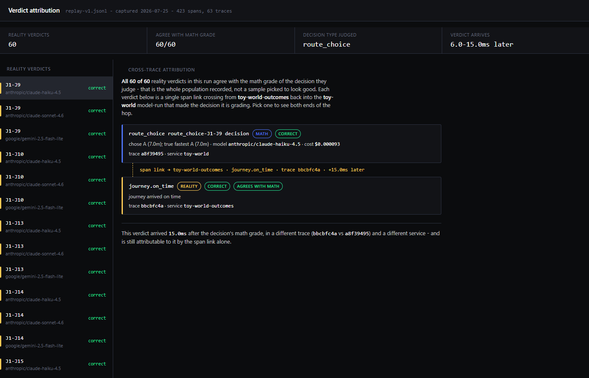
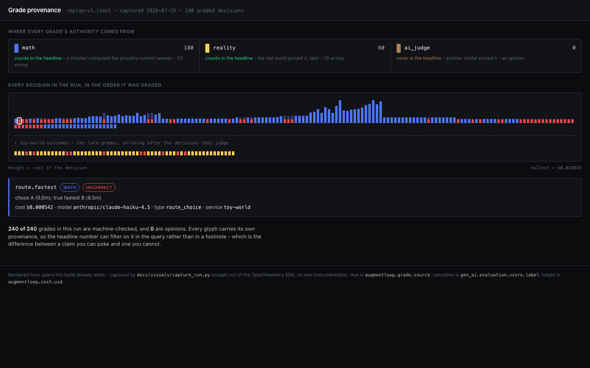

# Visuals

Renders over telemetry this build already emits. No new instrumentation, no
synthetic data: `capture_run.py` runs the same `toyworld.replay` through the
same Gradebook library and swaps only the exporter for an in-memory one, the
way the test suite does. Every span, attribute and span link in `run-data.js`
is the one that would have gone to SigNoz.

They are static files, so they open with a double-click and need no server, no
SigNoz, and no API key.

## Verdict attribution

A model-run trace holds 60 independent decision spans, not a sequential
journey - so there is no downstream to contaminate when reality disagrees with
one of them, and no `junction J<n>` span to walk forward through. What the data
still supports is the single hop: the conventions §6 span link (`Role 1`) that
carries a reality verdict, in service `toy-world-outcomes` and its own trace,
back to the one `route_choice` decision it judges, in service `toy-world` and
the model-run trace that made it.



**60 reality verdicts, all 60 judging a `route_choice` decision, all 60
agreeing with that decision's math grade.** That is the whole population
recorded in this run, not a sample chosen to look good. Each verdict arrives
6.0-15.0ms after the decision's math grade, in a different trace and a
different service, and is still attributable to it by the span link alone.
Pick any of the 60 verdicts in the rail to see both ends of its hop: the
decision's model, cost, math grade and explanation, and the verdict's own
explanation.

The span link is the point. It is the piece of architecture that makes a late,
cross-service, cross-trace verdict attributable to the decision that earned
it, and it is otherwise invisible plumbing. This page no longer claims a blast
radius - the old copy walked "every decision after the wrong one in the same
journey," which was true when a trace was one driver's journey through three
junctions, and is false now that a trace is 60 independent probes. Shipping
that claim over this data would assert a causal chain that does not exist, so
it was cut rather than left to render an empty radius.

## Grade provenance (genome strip)

Every graded decision in the run is one glyph, in the order it was graded.
**Hue is where the grade's authority came from**, saturation is whether it was
right, height is what it cost.



Blue is a `math` grade, amber is a `reality` grade, and sienna is reserved for
`ai_judge`. A wrong decision washes out and keeps a fully saturated cherry foot,
so bad runs read as red streaks along the baseline without inspecting a single
glyph. The dashed divider is where the run crosses into `toy-world-outcomes` -
the late grades that arrive after the decisions they judge.

**12 math, 4 reality, 0 ai_judge.** The zero is the point, not an omission: an
AI's opinion never silently enters the headline number ([ADR
0001](../adr/0001-machine-checked-grades-only-in-the-headline-metric.md)), and
the strip shows that as a fact about the run rather than a promise in prose.
Click any glyph for its model, cost and reasoning.

The glyphs scale with the run: at 16 decisions they are wide enough to click,
and they pack down to a hairline as the count grows. Verified by cloning the
strip to 176 glyphs in the browser - hue stays legible and the red baseline
still reads at a glance.

## Regret ledger

An options-book framing: a decision that has been math-graded but has no
real-world verdict yet is an open position carrying unrealized risk. When
reality arrives it closes that position green or red.


**12 positions, 8 open, 4 closed - 2 green, 2 red.** $0.002501 sits in open
positions, unrealized. The closed book is where the interesting row lives:
`replay-d1-J3` closed **correct** against its own math grade of **incorrect**
- the checker flagged the route as the slower one, and by the run's own
numbers it was, but the driver still arrived on time. A position can close
against its own math grade. That gap is the reason a reality grade exists at
all, rather than trusting the checker alone.

This is a 12-decision replay, not a claim about a larger book. Eight open
positions out of twelve is most of the book - that is the honest state of a
young run, not a gap in the recorder. Click any position for its full detail,
including the reality verdict's explanation where one has arrived.

## Regenerating

```bash
pip install -e reference-library -e toy-world
python docs/visuals/capture_run.py     # rewrites run-data.js from a fresh run
```

Then open `docs/visuals/blast-radius.html`, `docs/visuals/genome-strip.html`, or
`docs/visuals/regret-ledger.html`. All three read the same `run-data.js`. The
replay is deterministic, so the numbers do not move between runs; only the
trace and span ids do.
