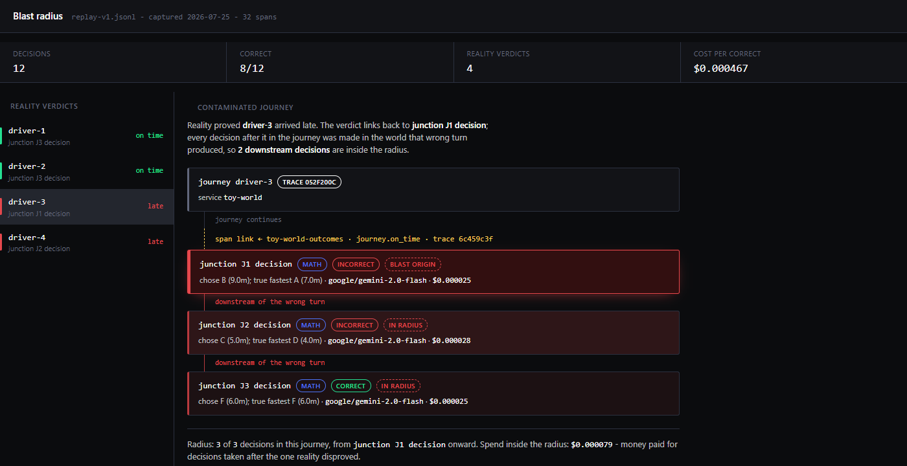

# Visuals

Renders over telemetry this build already emits. No new instrumentation, no
synthetic data: `capture_run.py` runs the same `toyworld.replay` through the
same Gradebook library and swaps only the exporter for an in-memory one, the
way the test suite does. Every span, attribute and span link in `run-data.js`
is the one that would have gone to SigNoz.

They are static files, so they open with a double-click and need no server, no
SigNoz, and no API key.

## Blast radius

When reality proves one decision wrong, every decision taken after it was made
in the world that wrong decision produced. This walks the conventions §6 span
link from a reality verdict back to the decision it judges, then forward
through the journey, and prices what sits inside the radius.



Reality proved `driver-3` arrived late. The verdict lives in a different trace
and a different service (`toy-world-outcomes`), and links back across that
boundary to `junction J1 decision`, where `google/gemini-2.0-flash` chose route
B at 9.0m over the true fastest A at 7.0m. The two junctions after it are
inside the radius: **3 of 3 decisions in the journey, $0.000079 of spend from
the disproved decision onward.** Click any of the four verdicts to re-seed it -
`driver-4`'s origin is J2, so J1 stays outside the radius, and the two on-time
verdicts show what a clean radius looks like.

The span link is the point. It is the piece of architecture that makes a late,
cross-service, cross-trace verdict attributable to the decision that earned it,
and it is otherwise invisible plumbing.

## Grade provenance (genome strip)

Every graded decision in the run is one glyph, in the order it was graded.
**Hue is where the grade's authority came from**, saturation is whether it was
right, height is what it cost.


Blue is a `math` grade, amber is a `reality` grade, and sienna is reserved for
`ai_judge`. A wrong decision washes out and keeps a fully saturated cherry foot,
so bad runs read as red streaks along the baseline without inspecting a single
glyph. The dashed divider is where the run crosses into `toy-world-outcomes` -
the late grades that arrive after the decisions they judge.

**12 math, 4 reality, 0 ai_judge.** The zero is the point, not an omission: an
AI's opinion never silently enters the headline number ([ADR
0001](../adr/0001-machine-checked-grades-only-in-the-headline-metric.md)), and
the strip shows that as a fact about the run rather than a promise in prose.
Click any glyph for its model, cost and reasoning.

The glyphs scale with the run: at 16 decisions they are wide enough to click,
and they pack down to a hairline as the count grows. Verified by cloning the
strip to 176 glyphs in the browser - hue stays legible and the red baseline
still reads at a glance.

## Regenerating

```bash
pip install -e reference-library -e toy-world
python docs/visuals/capture_run.py     # rewrites run-data.js from a fresh run
```

Then open `docs/visuals/blast-radius.html` or `docs/visuals/genome-strip.html`.
Both read the same `run-data.js`. The replay is deterministic, so the numbers do
not move between runs; only the trace and span ids do.
